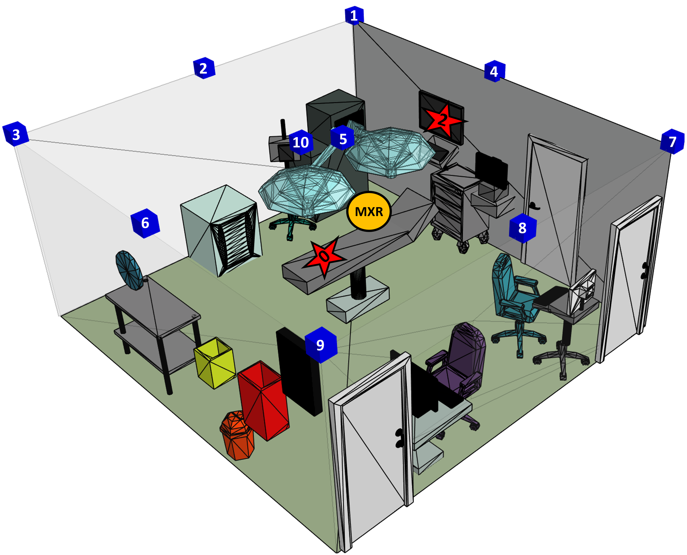

# 5G mmWave Mixed Reality (MXR) Simulation

This repository hosts the code required to replicate the findings discussed in our research paper entitled: "A Simulation Study of mmWave 5G-enabled Medical Extended Reality (MXR)" by Tanguy Ropitault, Yongkang Liu, Richard Rouil, and Mohamad Omar Al Kalaa. Our study explores a 5G Medical Extended Reality (MXR) setup, in which a surgeon uses a headset to perform surgeries, leveraging the capabilities of MXR technology . Communication between the Remote Host (RH) and User Equipment (UE) occurs over the Millimeter Wave (mmWave) band. The traffic model used is detailed in [this paper]{https://ieeexplore.ieee.org/document/10460522} and represents a Reduced Function Headset (RFH), also known as remote rendering.

This ns-3 implementation uses three repositories:
* [NYU WIRELESS UniPD ns-3 mmWave Module](https://github.com/nyuwireless-unipd/ns3-mmwave): This repository contains the core version of the ns-3 simulator utilized in our project.
* [UniPD ns-3 QD Channel Model](https://apps.nsnam.org/app/qd-channel/): This module enables the integration of the Quasi-Deterministic (Q-D) channel model with ns-3, facilitating  high-fidelity mmWave channel representation. The module is located in the `contrib/qd-channel` folder:
* [PSC NIST](https://github.com/usnistgov/psc-ns3/tree/psc-7.0/src/psc): This implementation utilizes the video streaming capability of the PSC module to generate traffic based on a Cumulative Distribution Function (CDF) traffic generator. It supports the creation of RFH (Reduced Function Headset) traffic patterns for Medical Extended Reality (MXR) applications. The video streaming-focused module is located in the `contrib/plc` folder of this repository.

## MXR Scenario Implementation

The MXR scenario, implemented in `mxr.cc` within the `scratch` folder, features three primary nodes:
- A remote host sending MXR traffic.
- A static 5G Base Station (BS), with 10 different positional scenarios provided.
- The 5G UE, simulating the surgeon's movements and gaze patterns during surgery.

The operational room's 3D model, with dimensions 5.75m x 5.48m x 2.8m, serves as the environment for our simulations. Below is a visualization showing the BS's ten different positions across the scenarios, with stars indicating the surgeon's primary focus points.



Additionally, we simulate the dynamic movements of the surgeon's head, represented by the UE's mobility, to reflect realistic surgical behavior. This includes focusing on the patient, interacting with staff, or consulting medical imagery.

### Visualization

Below is a GIF demonstrating the UE's mobility within an MXR scenario:


# How to Generate the Scenarios

The process of generating the MXR scenarios involves several steps, utilizing specific tools and software for mobility modeling and channel realization. Follow these steps to generate and prepare the scenarios for simulation:

1. **Mobility Model Generation:** Start by generating the mobility model using the [MXR Scenario Generator](https://gitlab.nist.gov/gitlab/tnr1/surgeryscenarios). This tool helps in creating realistic movement patterns for the scenario.

2. **Channel Realization:** After generating the scenarios, you need to generate the channel realizations for these scenarios using the [NIST Q-D Channel Realizations Software](https://github.com/wigig-tools/qd-realization). Follow these steps:
   - Place the `surgeryScenarios` folder, created by the MXR Scenario Generator, inside the `src/examples` folder of the Q-D channel realizations software.
   - Update the specific line in the `src/main.m` file (found [here](https://github.com/wigig-tools/qd-realization/blob/1ccf0cb61c1741cc3471db8ec0373c5383da58be/src/main.m#L56C48-L57C1)) to reflect the scenario for which you are generating the channel.
   - Execute the `src/main.m` script to generate the channel.

3. **Importing Channel into ns-3:**
   - Once the channel is generated, import it into ns-3 by copying the generated scenario folders into the `contrib/psc/qd-channel/model/QD/` directory of this repository.
   - The 10 scenarios used in the paper, labeled from `MXRPosition1` to `MXRPosition10`, are already included in this repository for convenience.

By following these steps, you can generate and prepare the scenarios needed to reproduce the results presented in the paper.

# RFH App
This repository includes 11 RFH Apps. The first seven (from 1 to 7) correspond to the RFH app discussed in LINKTOCREATE. This paper introduced a CDF distribution to model the traffic observed during measurement campaigns for various use-cases. The remaining four RFH apps simulate higher data rate traffic, such as those used in our paper to represent 4K and 8K traffic, in addition to two apps for 22 Mbps and 220 Mbps data rates.

# Usage
To start the simulation, execute the following command:
```bash
./ns3 run "mxr"
```
This command initiates the simulation with the default settings.

# Parameters

This section outlines the parameters available for simulation configuration:

- **`scenario`**: Specifies the folder containing the Quasi-Deterministic (Q-D) files generated using the NIST Q-D channel software. Valid options include \[MXRPosition1, MXRPosition2, MXRPosition3, MXRPosition4, MXRPosition5, MXRPosition6, MXRPosition7, MXRPosition8, MXRPosition9, MXRPosition10\]. Default is `MXRPosition1`.
- **`txPower`**: Defines the transmit power in dBm used by the Base Station (BS) and User Equipment (UE) for transmission. Default value is `10 dBm`.
- **`noiseFigure`**: Sets the noise figure in dB for both the BS and UE. Default is `12 dBm`.
- **`appStart`**: The start time of the application in seconds. Default is `1 s`.
- **`appEnd`**: The end time of the application in seconds. Default is `300 s`.
- **`resultsFolder`**: Specifies the directory where output traces will be saved. Default is `ResultsMXR`.
- **`rfhTraffic`**: Indicates whether RFH traffic is enabled. Default is `true`.
- **`rfhAppId`**: The ID of the RFH App being used. Valid entries are \[1, 2, 3, 4, 5, 6, 7, 22Mbps, 220Mbps, 4K, 8K\]. Default is `1`.
- **`beamformingInterval`**: Defines the frequency of beamforming training between the BS and UE in seconds. The default interval is `1`.
- **`codebookFile`**: Specifies the filename of the codebook to use. Default is `1x16.txt`.


# Output

The simulation generates its results into the directory specified by the `resultsFolder` parameter, further organized into subdirectories named `beamFIntervalX`, where `X` represents the value of the `beamformingInterval` parameter.

## Files Structure

The filenames follow a standard nomenclature: `scenario_resultsType_rfh-app-A_txPowerB_runNumberC.txt`, where:
- **`scenario`**: Reflects the value of the `scenario` parameter.
- **`resultsType`**: Indicates the type of results, detailed below.
- **`A`**: Represents the `rfhAppId` parameter value.
- **`B`**: Denotes the `txPower` parameter value.
- **`C`**: Is the `runNumber` parameter value.

## Results Types

The simulation outputs five types of results, each providing insights into different aspects of the scenario:

- **UE**: Logs PHY results at the UE, including the Modulation and Coding Scheme (MCS), number of retransmissions, corruption status, and the Block Error Rate (BLER) of any received packet.

- **Throughput**: Records the throughput and Packet Delivery Ratio (PDR).

- **SNR**: Documents the Reference Signal Received Power (RSRP) and Signal-to-Interference-plus-Noise Ratio (SINR) as reported by the UE to the BS.

- **Delay**: Captures the delay of application traffic received at the UE.

- **Beamforming**: Chronicles the beamforming training results between the BS and the UE.


